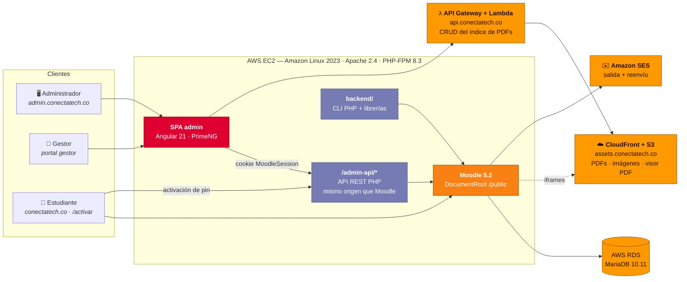

<div align="center">

# ConectaTech.co

**Plataforma educativa B2B para colegios colombianos, construida sobre Moodle 5.2 y AWS: cursos escritos en Markdown, acceso vendido como pines de activación y un panel de administración propio que opera todo el negocio.**

[](https://conectatech.co)
[](LICENSE)
[](https://moodle.org)
[](https://angular.dev)
[](https://www.php.net)
[](https://aws.amazon.com)
[](terraform/)
[](https://nasa-ammos.github.io/slim/?search=Badges)
[](https://nasa-ammos.github.io/slim/)
[](./README.md)

</div>

---

## Resumen ejecutivo

ConectaTech.co lleva cursos digitales a colegios colombianos que no tienen infraestructura tecnológica propia. Los colegios compran **paquetes de acceso** (cursos más cupos). Un representante del colegio, el **gestor**, reparte **pines de activación** entre sus estudiantes. El estudiante ingresa el pin en una página pública, se crea su cuenta de Moodle y queda matriculado de inmediato, sin trabajo manual del equipo de ConectaTech.

| | |
| :-- | :-- |
| **Producto** | LMS B2B para colegios: Moodle 5.2 más panel de administración propio, flujo público de activación y CDN de recursos |
| **Audiencias** | Administradores de ConectaTech · *gestores* de colegios · estudiantes |
| **Tracks comerciales** | **Directo:** colegios matriculados por CSV/Excel · **Indirecto:** organizaciones aliadas que gestionan sus propios cupos con pines |
| **Pipeline de contenido** | Los cursos se escriben en Markdown y se publican en Moodle como secciones, subsecciones, cuestionarios y ensayos con un solo comando |
| **Superficies** | [`conectatech.co`](https://conectatech.co) (LMS) · `admin.conectatech.co` (panel) · `assets.conectatech.co` (CDN) · `api.conectatech.co` (API de recursos) |
| **Entrega** | 181 commits · 30 pull requests fusionados · ~20 K LOC de aplicación · ~3,8 K LOC de IaC y aprovisionamiento, desde `2026-02-17` |
| **Humano en el ciclo** | Todo merge a `main` pasa por un pull request revisado por una persona. Los agentes de IA no pueden fusionar. |

---

## Cómo funciona

```
ConectaTech escribe el contenido (Markdown → Moodle)
        ↓
Se asignan paquetes de cursos a una organización
        ↓
El gestor del colegio recibe un pin de gestor
        ↓
El gestor emite pines de estudiante y los entrega
        ↓
El estudiante activa su pin → se crea su cuenta → queda matriculado
        ↓
El estudiante estudia en conectatech.co
```

### Capacidades principales

- **Pipeline Markdown → Moodle.** Un parser convierte Markdown estructurado en secciones de Moodle, subsecciones delegadas, etiquetas, cuestionarios GIFT y preguntas de ensayo. Comentarios HTML propios marcan bloques semánticos como `<!-- presaberes -->` y `<!-- reflexion -->`.
- **Árboles curriculares.** La estructura de cada curso se define una vez como árbol y se despliega en muchos cursos.
- **Acceso por pines.** `organización → paquete de pines → pin`, con un portal aparte donde los gestores asignan pines y consultan grupos y uso.
- **Matrícula masiva.** Importación por CSV y Excel para colegios del track directo.
- **Recursos PDF e imágenes en CDN.** Los archivos viven en S3 detrás de CloudFront y se incrustan en Moodle con un visor PDF propio. Nunca se sirven desde el servidor del LMS.
- **Reportes de uso.** Un plugin propio de Moodle, [`local_usagereports`](admin-module/backend/moodle-plugins/usagereports/), agrega una fuente de datos al Report Builder nativo.
- **Correo transaccional.** El correo saliente pasa por Amazon SES con DKIM, SPF y DMARC. El entrante lo reenvía una Lambda pequeña.

---

## Arquitectura



**Las decisiones que sostienen el diseño:**

1. **La API del panel comparte origen con Moodle.** Se sirve como `conectatech.co/admin-api/*`, no desde el subdominio admin, para que el navegador envíe la cookie `MoodleSession`. La autenticación reutiliza la sesión de Moodle. El panel nunca tiene un segundo sistema de login.
2. **La autorización se verifica en el servidor, siempre.** Los guards de Angular solo moldean la interfaz. Todo endpoint de escritura llama `verificarAdmin()` o `GestorAuth::verificar()` antes de hacer cualquier otra cosa.
3. **Moodle sigue siendo la fuente de verdad.** La API y la CLI cargan Moodle internamente y usan su API de base de datos con parámetros preparados. Los datos propios viven en un conjunto pequeño de tablas `ct_*`.
4. **Los archivos pesados no pasan por el servidor del LMS.** Los PDFs e imágenes se sirven desde S3 vía CloudFront. Una CSP con `frame-ancestors` limita la incrustación a los dominios de ConectaTech.

---

## Estructura del repositorio

```
conectatech.co/
├── admin-module/        Panel admin: SPA Angular, API REST PHP, CLI PHP + librerías, plugin Moodle
├── api-service/         Lambda (Node.js): API pública del índice de PDFs — api.conectatech.co
├── lambda/              Lambda (Node.js): reenvío de correo entrante (SES)
├── viewer-pdf/          Visor PDF Angular servido desde assets.conectatech.co
├── snippets/            SCSS/HTML inyectado en el tema de Moodle
├── terraform/           IaC: EC2, EBS, Elastic IP, RDS, security groups
├── scripts/             Aprovisionamiento: LAMP, Moodle, SSL, optimización, backups, monitoreo
├── docs/                Runbooks de infraestructura, CDN, pines, correo y upgrades
├── PRD.md               Requisitos de producto
├── tech-specs.md        Especificación técnica y arquitectura
├── MEMORY.md            Estado del proyecto y decisiones de arquitectura
└── CLAUDE.md            Instrucciones permanentes para agentes de IA
```

El panel de administración tiene su propio README: [`admin-module/README.es.md`](admin-module/README.es.md).

---

## Primeros pasos

### Panel de administración (desarrollo local)

```bash
git clone https://github.com/ocastelblanco/conectatech.co.git
cd conectatech.co/admin-module/frontend
npm install
npm start           # ng serve → http://localhost:4200
npm run build       # build de producción → dist/frontend/browser/
```

La API y la CLI en PHP necesitan una instancia de Moodle en funcionamiento. Ver [`admin-module/README.es.md`](admin-module/README.es.md).

### Aprovisionar un entorno nuevo

```bash
cd terraform/
cp terraform.tfvars.example terraform.tfvars   # completa tus valores; nunca commitees este archivo
terraform init && terraform plan -out=tfplan && terraform apply tfplan

cd ../scripts/
./02-setup-server.sh        # Apache + PHP 8.3 + extensiones
./03-install-moodle.sh      # Moodle 5.2 con DocumentRoot /public
./04-configure-ssl.sh       # Let's Encrypt + headers de seguridad
./05-optimize-system.sh     # PHP-FPM, OPcache, swap
./06-setup-backups.sh       # Snapshots de EBS y RDS
./07-setup-monitoring.sh    # Agente CloudWatch y alarmas
```

**Requisitos:** una cuenta AWS, AWS CLI v2, Terraform ≥ 1.0, Node.js para las apps Angular y un key pair de EC2. Los secretos, como la contraseña de la base de datos, el `config.php` de Moodle y las credenciales SMTP, viven solo en el servidor o en archivos ignorados. Nunca se commitean.

### Despliegue

No hay CI/CD. El despliegue es un `rsync` manual a EC2 seguido de un cambio de propietario al usuario `apache`. El procedimiento completo, incluidas las exclusiones que protegen `api/` y `backend/` en el servidor, está en [`admin-module/docs/infraestructura-servidor.md`](admin-module/docs/infraestructura-servidor.md) y en [`tech-specs.md` §7](tech-specs.md).

---

## Stack tecnológico

| Capa | Tecnología |
| :--- | :--- |
| LMS | Moodle 5.2 (DocumentRoot `/public`) |
| Frontend admin | Angular 21: componentes standalone, Signals, rutas lazy · PrimeNG 21 · Tailwind CSS 4 |
| API y CLI admin | PHP 8.3, sin framework, con Moodle cargado internamente |
| Base de datos | AWS RDS MariaDB 10.11 |
| Servidor web | Apache httpd 2.4 + PHP-FPM sobre Amazon Linux 2023 (ARM64, Graviton) |
| Recursos | S3 + CloudFront (`assets.conectatech.co`) · visor PDF en Angular |
| API pública | API Gateway HTTP API + Lambda (Node.js) |
| Correo | Amazon SES (DKIM, SPF, DMARC) + Lambda de reenvío |
| TLS | Let's Encrypt con renovación automática por certbot |
| IaC | Terraform + scripts Bash de aprovisionamiento |

---

## Seguridad

Las reglas de seguridad están escritas en el repositorio como restricciones permanentes en [`CLAUDE.md`](CLAUDE.md), mapeadas a la superficie de ataque real del sistema:

| OWASP | Control |
| :--- | :--- |
| **A01** Control de acceso roto | Todo endpoint de escritura verifica identidad de admin o gestor en el servidor como primera instrucción |
| **A02** Fallos criptográficos | `config.php`, `.env`, `*.pem` y credenciales nunca se commitean. Ningún secreto en código Angular. |
| **A03** Inyección / XSS | Solo la API `$DB` de Moodle con parámetros preparados. Nada de `[innerHTML]` con contenido de usuario. |
| **A05** Configuración incorrecta | CORS limitado a orígenes explícitos, nunca `*`. CSP de CloudFront con `frame-ancestors`. |
| **A07** Autenticación | Los endpoints públicos de activación validan formato de pin y rangos de cédula antes de tocar la base de datos |
| **A10** SSRF | Ningún endpoint hace peticiones a una URL enviada por el cliente |

---

## Contribuciones

El flujo de Git se aplica por política ([`CLAUDE.md`](CLAUDE.md)). Los cambios llegan a `main` solo mediante un pull request revisado por una persona.

1. Crea una rama desde `main` con prefijo `feature/*`, `fix/*`, `docs/*`, `hotfix/*` o `refactor/*`
2. Si cambió el frontend, confirma que `npm run build` pasa
3. Agrega archivos específicos. Nunca uses `git add .`
4. Abre un pull request contra `main`. Los agentes de IA nunca fusionan ni aprueban sus propios PR.

El código, los commits y la documentación se escriben en español colombiano.

---

## Documentación

| Documento | Contenido |
| :--- | :--- |
| [`PRD.md`](PRD.md) | Visión de producto, audiencias, casos de uso y roadmap |
| [`tech-specs.md`](tech-specs.md) | Arquitectura, stack, APIs, pipeline Markdown, despliegue y seguridad |
| [`MEMORY.md`](MEMORY.md) | Estado del proyecto y registros de decisiones de arquitectura |
| [`CLAUDE.md`](CLAUDE.md) | Instrucciones para agentes: convenciones, reglas OWASP, flujo de Git |
| [`docs/infraestructura-cdn.md`](docs/infraestructura-cdn.md) | S3 + CloudFront + API de recursos |
| [`docs/gestion-pines.md`](docs/gestion-pines.md) · [`docs/flujos-pines.md`](docs/flujos-pines.md) | Modelo de pines y flujos de activación |
| [`docs/moodle-upgrade.md`](docs/moodle-upgrade.md) | Runbook e historial de upgrades de Moodle |
| [`docs/email/AWS_EMAIL_SYSTEM.md`](docs/email/AWS_EMAIL_SYSTEM.md) | Configuración de SES y reenvío de correo |
| [`docs/01-architecture-overview.md`](docs/01-architecture-overview.md) … [`09-maintenance.md`](docs/09-maintenance.md) | Guías numeradas de infraestructura |

---

## Licencia

**Copyright © 2026 ConectaTech - Oliver Castelblanco. Todos los derechos reservados.** El código fuente es visible en este repositorio, pero no se otorga ninguna licencia para usarlo, copiarlo, modificarlo ni distribuirlo. Ver [`LICENSE`](LICENSE).

Los componentes de terceros conservan sus licencias originales (GPL v3+, Apache 2.0, MIT). Están listados en [`THIRD_PARTY_NOTICES.md`](THIRD_PARTY_NOTICES.md).

---

<div align="center">
<sub>Construido para <b>ConectaTech</b>, educación digital para colegios colombianos · Contacto: <a href="https://github.com/ocastelblanco">@ocastelblanco</a></sub>
</div>
