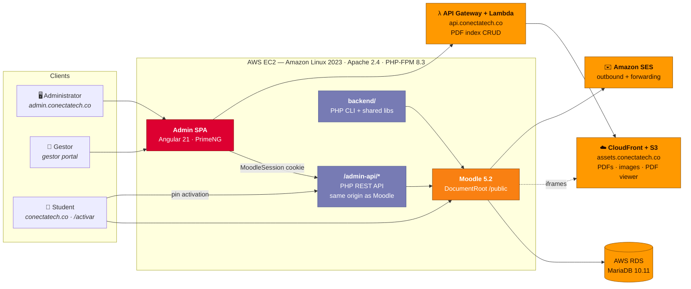

<div align="center">

# ConectaTech.co

**A B2B education platform for Colombian schools, built on Moodle 5.2 and AWS: courses written in Markdown, access sold as activation pins, and a custom admin panel that runs the whole operation.**

[](https://conectatech.co)
[](LICENSE)
[](https://moodle.org)
[](https://angular.dev)
[](https://www.php.net)
[](https://aws.amazon.com)
[](terraform/)
[](https://nasa-ammos.github.io/slim/?search=Badges)
[](https://nasa-ammos.github.io/slim/)
[](./README.es.md)

</div>

---

## Executive Summary

ConectaTech.co delivers digital courses to Colombian schools that don't have their own learning infrastructure. Schools buy **access packages** (courses plus seats). A school representative, the **gestor**, hands out **activation pins** to students. A student enters the pin on a public page, their Moodle account is created, and they are enrolled on the spot, with no manual work from the ConectaTech team.

| | |
| :-- | :-- |
| **Product** | B2B LMS for schools: Moodle 5.2 plus a custom admin panel, public activation flow and resource CDN |
| **Audiences** | ConectaTech administrators · school *gestores* · students |
| **Commercial tracks** | **Direct:** schools enrolled by CSV/Excel · **Indirect:** partner organizations that manage their own seats with pins |
| **Content pipeline** | Courses are written in Markdown and published to Moodle as sections, subsections, quizzes and essays by one command |
| **Surfaces** | [`conectatech.co`](https://conectatech.co) (LMS) · `admin.conectatech.co` (admin panel) · `assets.conectatech.co` (CDN) · `api.conectatech.co` (resource API) |
| **Delivery** | 181 commits · 30 merged pull requests · ~20 K LOC application · ~3.8 K LOC IaC and provisioning, since `2026-02-17` |
| **Human in the loop** | Every merge to `main` goes through a human-reviewed pull request. AI agents may not merge. |

---

## How It Works

```
ConectaTech writes content (Markdown → Moodle)
        ↓
Course packages are assigned to an organization
        ↓
The school's gestor receives a gestor pin
        ↓
The gestor issues student pins and hands them out
        ↓
The student activates the pin → account created → enrolled
        ↓
The student studies at conectatech.co
```

### Key capabilities

- **Markdown → Moodle pipeline.** A parser turns structured Markdown into Moodle sections, delegated subsections, labels, GIFT quizzes and essay questions. Custom HTML comments mark semantic blocks such as `<!-- presaberes -->` and `<!-- reflexion -->`.
- **Curriculum trees.** Each course structure is defined once as a tree and deployed to many courses.
- **Pin-based access.** `organization → pin package → pin`, with a separate portal where gestores assign pins and check groups and usage.
- **Bulk enrollment.** CSV and Excel import for schools on the direct track.
- **PDF and image resources on a CDN.** Files live in S3 behind CloudFront and are embedded in Moodle through a custom PDF viewer. They are never served from the LMS server.
- **Usage reporting.** A custom Moodle plugin, [`local_usagereports`](admin-module/backend/moodle-plugins/usagereports/), adds a data source to Moodle's native Report Builder.
- **Transactional email.** Outgoing mail goes through Amazon SES with DKIM, SPF and DMARC. Incoming mail is forwarded by a small Lambda.

---

## Architecture



**The decisions that carry the design:**

1. **The admin API shares Moodle's origin.** It is served as `conectatech.co/admin-api/*`, not from the admin subdomain, so the browser sends the `MoodleSession` cookie. Authentication reuses Moodle's own session. The panel never gets a second login system.
2. **Authorization is checked on the server, every time.** Angular guards only shape the UI. Every write endpoint calls `verificarAdmin()` or `GestorAuth::verificar()` before doing anything else.
3. **Moodle stays the system of record.** The API and CLI load Moodle internally and use its database API with prepared parameters. Custom data lives in a small set of `ct_*` tables.
4. **Heavy files stay off the LMS server.** PDFs and images are served from S3 through CloudFront. A `frame-ancestors` CSP limits embedding to ConectaTech's own domains.

---

## Repository Layout

```
conectatech.co/
├── admin-module/        Admin panel: Angular SPA, PHP REST API, PHP CLI + libs, Moodle plugin
├── api-service/         Lambda (Node.js): public PDF index API — api.conectatech.co
├── lambda/              Lambda (Node.js): inbound email forwarder (SES)
├── viewer-pdf/          Angular PDF viewer served from assets.conectatech.co
├── snippets/            SCSS/HTML injected into the Moodle theme
├── terraform/           IaC: EC2, EBS, Elastic IP, RDS, security groups
├── scripts/             Server provisioning: LAMP, Moodle, SSL, tuning, backups, monitoring
├── docs/                Infrastructure, CDN, pins, email and upgrade runbooks
├── PRD.md               Product requirements
├── tech-specs.md        Technical specification and architecture
├── MEMORY.md            Project state and architecture decisions
└── CLAUDE.md            Permanent instructions for AI agents
```

The admin panel has its own README: [`admin-module/README.md`](admin-module/README.md).

---

## Getting Started

### Admin panel (local development)

```bash
git clone https://github.com/ocastelblanco/conectatech.co.git
cd conectatech.co/admin-module/frontend
npm install
npm start           # ng serve → http://localhost:4200
npm run build       # production build → dist/frontend/browser/
```

The PHP API and CLI need a running Moodle instance. See [`admin-module/README.md`](admin-module/README.md).

### Provisioning a new environment

```bash
cd terraform/
cp terraform.tfvars.example terraform.tfvars   # fill in your values; never commit this file
terraform init && terraform plan -out=tfplan && terraform apply tfplan

cd ../scripts/
./02-setup-server.sh        # Apache + PHP 8.3 + extensions
./03-install-moodle.sh      # Moodle 5.2 with /public DocumentRoot
./04-configure-ssl.sh       # Let's Encrypt + security headers
./05-optimize-system.sh     # PHP-FPM, OPcache, swap
./06-setup-backups.sh       # EBS and RDS snapshots
./07-setup-monitoring.sh    # CloudWatch agent and alarms
```

**Requirements:** an AWS account, AWS CLI v2, Terraform ≥ 1.0, Node.js for the Angular apps, and an EC2 key pair. Secrets such as the database password, Moodle `config.php` and SMTP credentials live only on the server or in ignored files. They are never committed.

### Deployment

There is no CI/CD. Deployment is a manual `rsync` to EC2 followed by an ownership reset to the `apache` user. The full procedure, including the exclusions that protect `api/` and `backend/` on the server, is in [`admin-module/docs/infraestructura-servidor.md`](admin-module/docs/infraestructura-servidor.md) and [`tech-specs.md` §7](tech-specs.md).

---

## Tech Stack

| Layer | Technology |
| :--- | :--- |
| LMS | Moodle 5.2 (`/public` DocumentRoot) |
| Admin frontend | Angular 21: standalone components, Signals, lazy routes · PrimeNG 21 · Tailwind CSS 4 |
| Admin API and CLI | PHP 8.3, no framework, Moodle bootstrapped internally |
| Database | AWS RDS MariaDB 10.11 |
| Web server | Apache httpd 2.4 + PHP-FPM on Amazon Linux 2023 (ARM64, Graviton) |
| Resources | S3 + CloudFront (`assets.conectatech.co`) · Angular PDF viewer |
| Public API | API Gateway HTTP API + Lambda (Node.js) |
| Email | Amazon SES (DKIM, SPF, DMARC) + Lambda forwarder |
| TLS | Let's Encrypt with automatic certbot renewal |
| IaC | Terraform + Bash provisioning scripts |

---

## Security

Security rules are written into the repository as permanent constraints in [`CLAUDE.md`](CLAUDE.md), mapped to this system's actual attack surface:

| OWASP | Control |
| :--- | :--- |
| **A01** Broken access control | Every write endpoint verifies admin or gestor identity server-side as its first instruction |
| **A02** Cryptographic failures | `config.php`, `.env`, `*.pem` and credentials are never committed. No secrets in Angular code. |
| **A03** Injection / XSS | Moodle `$DB` API with prepared parameters only. No `[innerHTML]` with user content. |
| **A05** Misconfiguration | CORS limited to explicit origins, never `*`. CloudFront CSP with `frame-ancestors`. |
| **A07** Authentication | Public activation endpoints validate pin format and ID ranges before touching the database |
| **A10** SSRF | No endpoint fetches a URL supplied by the client |

---

## Contributing

Git flow is enforced by policy ([`CLAUDE.md`](CLAUDE.md)). Changes reach `main` only through a human-reviewed pull request.

1. Branch from `main` using `feature/*`, `fix/*`, `docs/*`, `hotfix/*` or `refactor/*`
2. If the frontend changed, confirm `npm run build` passes
3. Stage specific files. Never use `git add .`
4. Open a pull request against `main`. AI agents never merge or approve their own PRs.

Code, commits and documentation are written in Colombian Spanish.

---

## Documentation

| Document | Contents |
| :--- | :--- |
| [`PRD.md`](PRD.md) | Product vision, audiences, use cases and roadmap |
| [`tech-specs.md`](tech-specs.md) | Architecture, stack, APIs, Markdown pipeline, deployment and security |
| [`MEMORY.md`](MEMORY.md) | Project state and architecture decision records |
| [`CLAUDE.md`](CLAUDE.md) | Agent instructions: conventions, OWASP rules, git flow |
| [`docs/infraestructura-cdn.md`](docs/infraestructura-cdn.md) | S3 + CloudFront + resource API |
| [`docs/gestion-pines.md`](docs/gestion-pines.md) · [`docs/flujos-pines.md`](docs/flujos-pines.md) | Pin model and activation flows |
| [`docs/moodle-upgrade.md`](docs/moodle-upgrade.md) | Moodle upgrade runbook and history |
| [`docs/email/AWS_EMAIL_SYSTEM.md`](docs/email/AWS_EMAIL_SYSTEM.md) | SES setup and email forwarding |
| [`docs/01-architecture-overview.md`](docs/01-architecture-overview.md) … [`09-maintenance.md`](docs/09-maintenance.md) | Numbered infrastructure guides |

---

## License

**Copyright © 2026 Ideas Maestras Inc. (ConectaTech.co). All rights reserved.** The source is visible in this repository, but no license to use, copy, modify or distribute it is granted. See [`LICENSE`](LICENSE).

Third-party components keep their original licenses (GPL v3+, Apache 2.0, MIT). They are listed in [`THIRD_PARTY_NOTICES.md`](THIRD_PARTY_NOTICES.md).

---

<div align="center">
<sub>Built for <b>ConectaTech</b>, digital education for Colombian schools · Contact: <a href="https://github.com/ocastelblanco">@ocastelblanco</a></sub>
</div>
