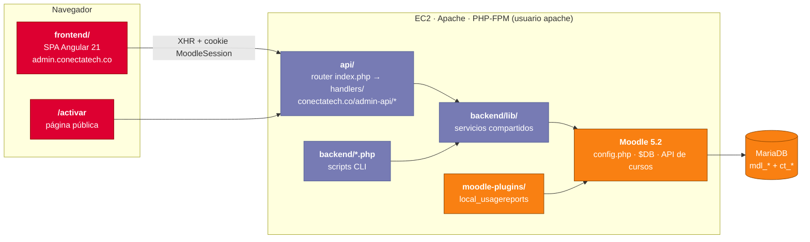

<div align="center">

# Módulo de administración ConectaTech

**El panel de operación detrás de ConectaTech.co: una SPA en Angular y una API PHP sin framework que viven dentro de la propia sesión de Moodle y manejan la publicación de contenido, los árboles curriculares, los pines y las matrículas.**

[](https://admin.conectatech.co)
[](../LICENSE)
[](https://angular.dev)
[](https://primeng.org)
[](https://www.php.net)
[](https://moodle.org)
[](https://nasa-ammos.github.io/slim/?search=Badges)
[](https://nasa-ammos.github.io/slim/)
[](./README.md)

</div>

---

## Qué es

Moodle es bueno para dictar cursos y no tanto para operar un negocio encima de ellos. Este módulo agrega lo que ConectaTech necesita y Moodle no trae de fábrica:

- **Publicar cursos completos desde Markdown** en lugar de armarlos clic a clic
- **Árboles curriculares** que definen la estructura de un curso una vez y la despliegan en muchos colegios
- **Organizaciones, paquetes de pines y pines** para el track de venta indirecta
- **Matrícula masiva por CSV** para colegios del track directo
- **Un portal de gestor**, para que los representantes de los colegios asignen cupos por su cuenta
- **Una página pública de activación**, donde el estudiante convierte un pin en una cuenta matriculada

No reemplaza a Moodle. Carga Moodle internamente y trabaja con sus propias APIs y su capa de base de datos. Moodle sigue siendo la fuente de verdad. Para la visión general de la plataforma, ver el [README raíz](../README.es.md).

---

## Arquitectura



**Tres niveles de acceso, todos verificados en el servidor:**

| Nivel | Quién | Mecanismo | Verificación server-side |
| :--- | :--- | :--- | :--- |
| Público | Cualquiera que active un pin | Ninguno | Formato de pin y rangos de cédula validados antes de consultar la BD |
| Gestor | Representante del colegio u organización | Cookie `MoodleSession` + consulta a `ct_gestor` | `GestorAuth::verificar()` |
| Administrador | Equipo ConectaTech | Cookie `MoodleSession` + `is_siteadmin()` | `verificarAdmin()` en `api/auth.php` |

La API se sirve desde `conectatech.co/admin-api/*`, no desde el subdominio admin, porque Moodle limita su cookie de sesión a `conectatech.co`. Desde cualquier otro origen el navegador no enviaría la cookie y la autenticación fallaría.

---

## Estructura

```
admin-module/
├── frontend/                 SPA Angular 21 (componentes standalone, Signals, rutas lazy)
│   └── src/app/
│       ├── core/             guards, interceptors, servicios
│       ├── layout/           shell de admin y shell separado de gestor
│       └── features/         dashboard · contenido · cursos · arboles · activos · matriculas
│                             instituciones · organizaciones · pines · reportes · gestor · activar
├── api/                      API REST PHP, sin framework
│   ├── index.php             router: interpreta método + ruta y carga el handler correspondiente
│   ├── auth.php              verificarAdmin()
│   └── handlers/             uno por dominio: cursos, markdown, arboles, matriculas, pines, ...
├── backend/                  Scripts CLI PHP + librerías compartidas con api/
│   ├── lib/                  MarkdownParser, HtmlConverter, GiftConverter, MoodleContentBuilder,
│   │                         PinesService, MatriculasService, ArbolCurricularService, ...
│   ├── config/               semantic-blocks.json, mapeos CSV/JSON de cursos y matrículas
│   └── moodle-plugins/       local_usagereports (GPL v3+, ver THIRD_PARTY_NOTICES)
└── docs/                     arquitectura, árbol curricular, uso de la CLI, infraestructura del servidor
```

---

## Primeros pasos

### Frontend

```bash
cd admin-module/frontend
npm install
npm start          # ng serve → http://localhost:4200
npm run build      # build de producción → dist/frontend/browser/
npm test           # Karma + Jasmine
```

Prettier está configurado con `printWidth: 100` y `singleQuote: true`.

### API y CLI

El código PHP arranca una instalación real de Moodle, así que corre en el servidor y no en local. Los scripts CLI se ejecutan siempre como usuario `apache`:

```bash
sudo -u apache php /var/www/html/admin/backend/procesar-markdown.php --file <archivo.md> --course <shortname>
```

| Script | Propósito |
| :--- | :--- |
| `procesar-markdown.php` | Convierte un archivo Markdown en el contenido de un curso repositorio |
| `crear-cursos.php` | Crea cursos finales (por colegio y grado) desde un CSV |
| `poblar-cursos.php` | Clona secciones de cursos repositorio a cursos finales |
| `matricular.php` | Crea o actualiza usuarios y los matricula en sus cursos |
| `limpiar-cms-huerfanos.php` | Limpieza diaria de módulos de curso huérfanos (cron) |

Los argumentos y ejemplos completos están en [`docs/uso-cli.md`](docs/uso-cli.md).

### Despliegue

El despliegue es manual. Es un `rsync` a `/var/www/html/admin/` más un cambio de propietario a `apache`. El frontend se sincroniza **desde** `dist/frontend/browser/` con `--delete --exclude=api --exclude=backend`. Si se omiten esas exclusiones, se borra la API del servidor. El procedimiento completo está en [`docs/infraestructura-servidor.md`](docs/infraestructura-servidor.md).

---

## Convenciones

- **PHP:** siempre `error_log()`, nunca `fwrite(STDERR, …)`. Los scripts CLI definen `CLI_SCRIPT` antes de cargar Moodle. Una clase por archivo, sin namespaces. Solo parámetros preparados vía `$DB`.
- **Angular:** componentes standalone, Signals para estado local, `OnPush` en listas, `loadComponent()` en todas las rutas. Nada de `[innerHTML]` con contenido de usuario.
- **Seguridad:** todo endpoint de escritura llama `verificarAdmin()` o `GestorAuth::verificar()` como primera instrucción.

Las reglas completas, el mapeo OWASP y el flujo de Git obligatorio están en el [`CLAUDE.md`](../CLAUDE.md) raíz.

---

## Documentación

| Documento | Contenido |
| :--- | :--- |
| [`docs/arquitectura-tecnica-definitiva.md`](docs/arquitectura-tecnica-definitiva.md) | Arquitectura técnica del módulo |
| [`docs/arbol-curricular.md`](docs/arbol-curricular.md) | Modelo del árbol curricular |
| [`docs/uso-cli.md`](docs/uso-cli.md) | Scripts CLI: argumentos, formatos, flujo completo |
| [`docs/infraestructura-servidor.md`](docs/infraestructura-servidor.md) | Estructura del servidor y protocolo de despliegue |
| [`backend/moodle-plugins/usagereports/README.md`](backend/moodle-plugins/usagereports/README.md) | Plugin de reportes de uso |
| [`../tech-specs.md`](../tech-specs.md) | Especificación técnica de toda la plataforma |

---

## Licencia

**Copyright © 2026 ConectaTech - Oliver Castelblanco. Todos los derechos reservados.** Ver el [`LICENSE`](../LICENSE) raíz.

El plugin de Moodle en `backend/moodle-plugins/usagereports/` se licencia bajo **GNU GPL v3 o posterior**, como lo exige Moodle a sus plugins. Los demás componentes de terceros están listados en [`THIRD_PARTY_NOTICES.md`](../THIRD_PARTY_NOTICES.md).
