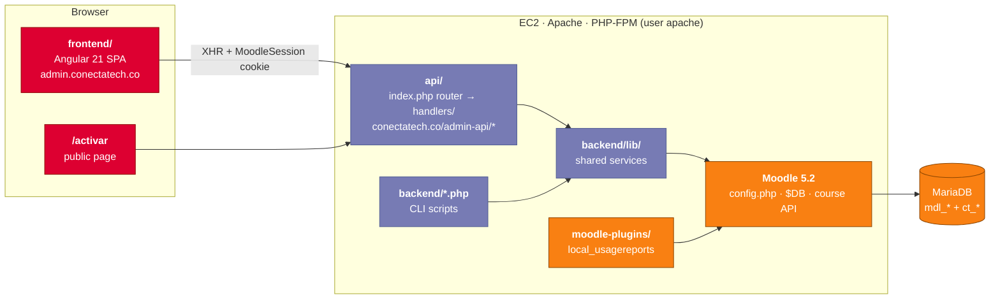

<div align="center">

# ConectaTech Admin Module

**The operations panel behind ConectaTech.co: an Angular SPA and a framework-free PHP API that sit inside Moodle's own session and run content publishing, curriculum trees, pins and enrollments.**

[](https://admin.conectatech.co)
[](../LICENSE)
[](https://angular.dev)
[](https://primeng.org)
[](https://www.php.net)
[](https://moodle.org)
[](https://nasa-ammos.github.io/slim/?search=Badges)
[](https://nasa-ammos.github.io/slim/)
[](./README.es.md)

</div>

---

## What It Is

Moodle is good at running courses and less good at running a business on top of them. This module adds what ConectaTech needs and Moodle doesn't provide out of the box:

- **Publishing whole courses from Markdown** instead of building them click by click
- **Curriculum trees** that define a course structure once and roll it out to many schools
- **Organizations, pin packages and pins** for the indirect sales track
- **Bulk CSV enrollment** for schools on the direct track
- **A gestor portal**, so school representatives assign seats themselves
- **A public activation page**, where a student turns a pin into an enrolled account

It doesn't replace Moodle. It loads Moodle internally and works through Moodle's own APIs and database layer. Moodle stays the system of record. For the platform-level overview, see the [root README](../README.md).

---

## Architecture



**Three levels of access, all checked on the server:**

| Level | Who | Mechanism | Server-side check |
| :--- | :--- | :--- | :--- |
| Public | Anyone activating a pin | None | Pin format and ID ranges validated before any DB query |
| Gestor | School or organization representative | `MoodleSession` cookie + `ct_gestor` lookup | `GestorAuth::verificar()` |
| Administrator | ConectaTech team | `MoodleSession` cookie + `is_siteadmin()` | `verificarAdmin()` in `api/auth.php` |

The API is served from `conectatech.co/admin-api/*`, not from the admin subdomain, because Moodle scopes its session cookie to `conectatech.co`. On any other origin the browser wouldn't send the cookie and authentication would fail.

---

## Layout

```
admin-module/
├── frontend/                 Angular 21 SPA (standalone components, Signals, lazy routes)
│   └── src/app/
│       ├── core/             guards, interceptors, services
│       ├── layout/           admin shell and separate gestor shell
│       └── features/         dashboard · contenido · cursos · arboles · activos · matriculas
│                             instituciones · organizaciones · pines · reportes · gestor · activar
├── api/                      PHP REST API, no framework
│   ├── index.php             router: parses method + path, loads the matching handler
│   ├── auth.php              verificarAdmin()
│   └── handlers/             one per domain: cursos, markdown, arboles, matriculas, pines, ...
├── backend/                  PHP CLI scripts + libraries shared with api/
│   ├── lib/                  MarkdownParser, HtmlConverter, GiftConverter, MoodleContentBuilder,
│   │                         PinesService, MatriculasService, ArbolCurricularService, ...
│   ├── config/               semantic-blocks.json, CSV/JSON mappings for courses and enrollment
│   └── moodle-plugins/       local_usagereports (GPL v3+, see THIRD_PARTY_NOTICES)
└── docs/                     architecture, curriculum tree, CLI usage, server infrastructure
```

---

## Getting Started

### Frontend

```bash
cd admin-module/frontend
npm install
npm start          # ng serve → http://localhost:4200
npm run build      # production build → dist/frontend/browser/
npm test           # Karma + Jasmine
```

Prettier is configured with `printWidth: 100` and `singleQuote: true`.

### API and CLI

The PHP code bootstraps a real Moodle installation, so it runs on the server rather than locally. CLI scripts always run as the `apache` user:

```bash
sudo -u apache php /var/www/html/admin/backend/procesar-markdown.php --file <file.md> --course <shortname>
```

| Script | Purpose |
| :--- | :--- |
| `procesar-markdown.php` | Turns a Markdown file into the content of a repository course |
| `crear-cursos.php` | Creates final courses (per school and grade) from a CSV |
| `poblar-cursos.php` | Clones sections from repository courses into final courses |
| `matricular.php` | Creates or updates users and enrolls them in their courses |
| `limpiar-cms-huerfanos.php` | Daily cleanup of orphaned course modules (cron) |

Arguments and full examples are in [`docs/uso-cli.md`](docs/uso-cli.md).

### Deployment

Deployment is manual. It's an `rsync` to `/var/www/html/admin/` plus an ownership reset to `apache`. The frontend syncs **from** `dist/frontend/browser/` with `--delete --exclude=api --exclude=backend`. Leaving out those exclusions deletes the API on the server. The full procedure is in [`docs/infraestructura-servidor.md`](docs/infraestructura-servidor.md).

---

## Conventions

- **PHP:** always `error_log()`, never `fwrite(STDERR, …)`. CLI scripts define `CLI_SCRIPT` before loading Moodle. One class per file, no namespaces. Only prepared parameters through `$DB`.
- **Angular:** standalone components, Signals for local state, `OnPush` on lists, `loadComponent()` for every route. No `[innerHTML]` with user content.
- **Security:** every write endpoint calls `verificarAdmin()` or `GestorAuth::verificar()` as its first instruction.

Full rules, the OWASP mapping and the mandatory git flow are in the root [`CLAUDE.md`](../CLAUDE.md).

---

## Documentation

| Document | Contents |
| :--- | :--- |
| [`docs/arquitectura-tecnica-definitiva.md`](docs/arquitectura-tecnica-definitiva.md) | Technical architecture of the module |
| [`docs/arbol-curricular.md`](docs/arbol-curricular.md) | Curriculum tree model |
| [`docs/uso-cli.md`](docs/uso-cli.md) | CLI scripts: arguments, formats, full workflow |
| [`docs/infraestructura-servidor.md`](docs/infraestructura-servidor.md) | Server layout and deployment protocol |
| [`backend/moodle-plugins/usagereports/README.md`](backend/moodle-plugins/usagereports/README.md) | Usage reports plugin |
| [`../tech-specs.md`](../tech-specs.md) | Platform-wide technical specification |

---

## License

**Copyright © 2026 ConectaTech - Oliver Castelblanco. All rights reserved.** See the root [`LICENSE`](../LICENSE).

The Moodle plugin in `backend/moodle-plugins/usagereports/` is licensed under the **GNU GPL v3 or later**, as Moodle plugins must be. Other third-party components are listed in [`THIRD_PARTY_NOTICES.md`](../THIRD_PARTY_NOTICES.md).
